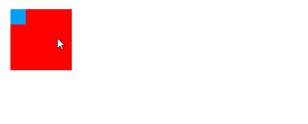
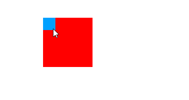

## vue-movable-element 

vue component for giving HTML element ability to move.
- provide movable anchor
- nested move element
- provide move event
- moving within movable anchor boundaries
- no extra javascript framework dependency

## Example

```html
<template>
    <movable-anchor style="margin-left: 50px;">
        <movable style="background-color: red; width: 100px; height: 100px;">
            <movable-anchor>
                <movable style="background-color: #00a0ff; width: 25px; height: 25px;"></movable>
            </movable-anchor>
        </movable>
    </movable-anchor>
</template>
```





## API

### MovableAnchor

provide anchor for movable component.

#### props

no props

#### events

resize which window have been resized.

### Movable

#### props

- active, boolean, whether to active move ability.
- value, give initial position value, a number array ([left, top]) represent for left and top px from movable anchor top-left to moable element top-left.
- bounding, boolean, indicates that movable element can move out of the movable anchor's content.

#### events

input, array, emit current movable element [left, top].
